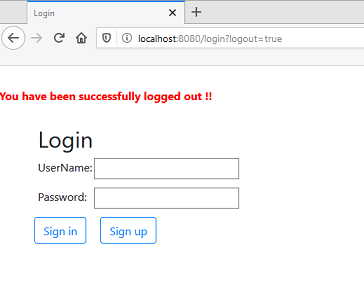
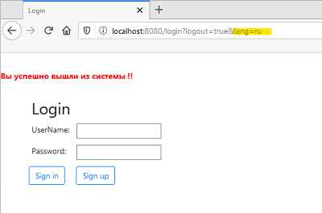

 

# Forum (Spring Boot App)

Repository contains implementation simple model of forum which demonstrate working with Spring Boot. 
                         
#### Project's features:
- using Spring Boot;
- JPA entities store into PostgreSQL DB;
- authorization via Spring Security with registration form;
- added internationalization.

#### Login form

#### Registration form

#### Index page

#### Adding new post

#### Logout and Internationalization

 